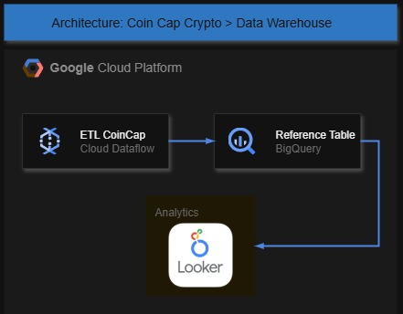

# Crypto Data Collector

## Visão Geral do Projeto

Este projeto é uma aplicação em Python projetada para coletar dados de criptomoedas de uma API de Criptomoedas, processá-los e armazená-los no BigQuery do GCP. Os dados coletados são então utilizados para a criação de um dashboard analítico no Looker Studio.

### Estrutura e Arquitetura do Pipeline

A arquitetura do projeto segue um pipeline de dados simples, com as seguintes etapas:

1.  **Coleta de Dados:** O script Python se conecta à **CoinCap API** para extrair informações sobre criptomoedas específicas.
2.  **Processamento:** Os dados brutos da API são transformados em um formato estruturado usando a biblioteca `pandas`. Tipos de dados são ajustados para garantir a consistência e a integridade.
3.  **Armazenamento (Data Warehouse):** Os dados processados são carregados em um **dataset** no **Google BigQuery**, um serviço de data warehouse na nuvem.
4.  **Análise e Visualização:** As tabelas no BigQuery servem como fonte de dados para um dashboard analítico no **Google Looker Studio**.

### Diagrama do Banco de Dados (BigQuery)

O esquema do banco de dados é simples e eficiente para o propósito deste projeto. A tabela principal armazena os dados descritivos das criptomoedas e outra tabela contém histórico de cotação em dólar.


* **coin**
    * `id`: Identificador da criptomoeda (ex: 'bitcoin', 'ethereum').
    * `name`: Nome comercial da criptomoeda.
    * `symbol`: Ticker (abreviação) utilizado em comércio.
    * `rank`: Posição no ranking de mercado.
    * `maxSupply`: Quantidade máxima possível.

* **price**
    * `id`: Identificador da criptomoeda (ex: 'bitcoin', 'ethereum').
    * `priceUsd`: Preço da criptomoeda em dólares americanos. O tipo `NUMERIC` garante alta precisão.
    * `date`: Data da coleta dos dados.

### Possível criação de pipeline

O projeto em si não é completo e não possui um esquema de pipeline, porém ele permite a criação de uma pipeline simples caso desejar. Abaixo um exemplo do cenário que pode ser criado.



---

## Como Configurar e Executar

### Pré-requisitos

* Conta no Google Cloud Platform (GCP) com um projeto ativo.
* Credenciais da API da CoinCap.

Todos os requisitos acima são fornecidos pelo criador para teste, ou se preferir crie o seu ambiente.

### 1. Configuração do Ambiente

1.  Clone este repositório:
    `git clone https://github.com/RafaelOkabe/crypto-data-collector.git`
    `cd crypto-data-collector`

2.  Instale as dependências do Python:
    `pip install -r requirements.txt`

3.  Crie um arquivo `.env` na raiz do projeto com suas credenciais e configurações:

    ```bash
    COINCAP_API_KEY="sua_chave_da_api"
    GOOGLE_APPLICATION_CREDENTIALS="caminho/para/seu/arquivo/credentials.json"
    ```

    > **Nota:** Certifique-se de que o arquivo de credenciais (`credentials.json`) tem permissão para acessar e gravar no BigQuery.

### 2. Execução do Programa

Basta executar o script principal:
`python src/main.py`

O programa irá coletar os dados da API e carregá-los na tabela do BigQuery especificada.

## Dashboard Looker

[](https://lookerstudio.google.com/s/tvc2xy50wks)

## Contato

* **Rafael Y. Okabe** - (https://www.linkedin.com/in/rafael-yoshio-okabe-b58b3b136/)